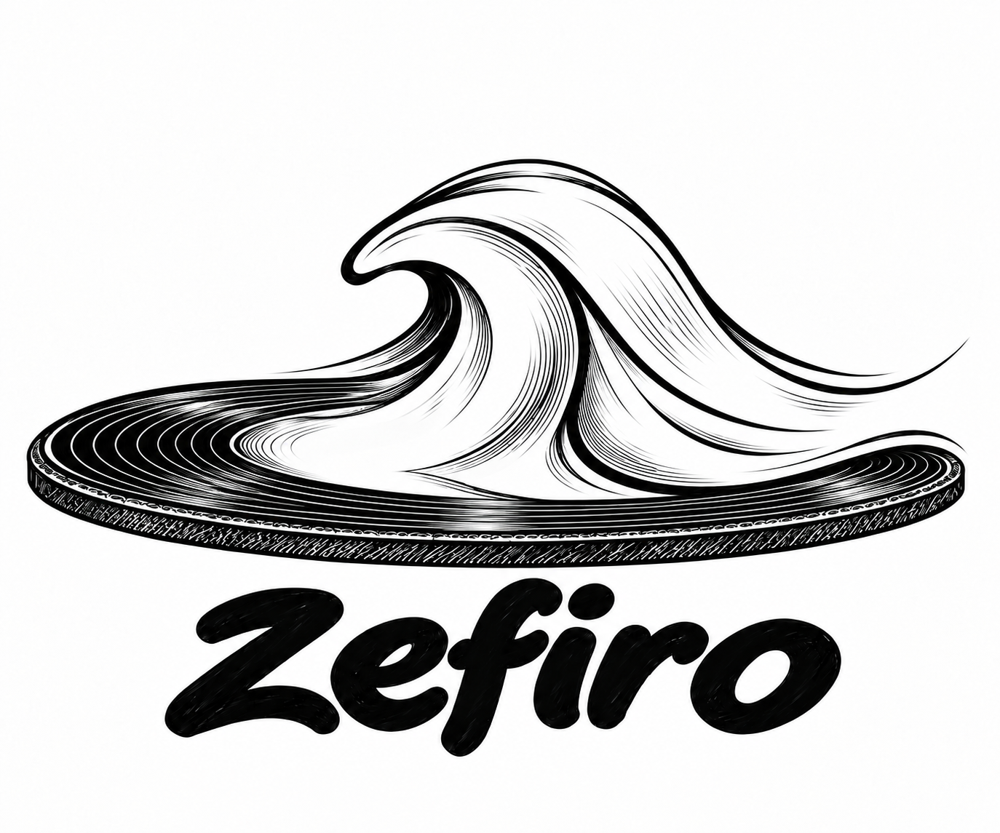

# zefiro

<p align="center"></p>

A terminal music player for macOS. It plays a local music folder and
Subsonic-compatible servers such as Navidrome, and draws everything in the
terminal with ratatui.

## Install

Build, sign and install through a local Homebrew tap named `local/zefiro`:

```sh
sh scripts/brew-tap.sh
```

The script builds the release binary, signs it with an Apple Development
identity and installs it from the tap.

Or run it from the checkout:

```sh
cargo run --release -p zefiro
```

The Rust toolchain is a pinned nightly, set in `rust-toolchain.toml`; rustup
installs it on the first build.

## Usage

```
A terminal music player

Usage: zefiro [OPTIONS] [PATH]

Arguments:
  [PATH]  Play this folder for this run only, without saving it

Options:
      --music-dir <PATH>     Save this folder as music_dir in config.toml and start on it
      --theme <THEME>        Use this theme for this run only: auto, an embedded theme or a themes/<name>.toml file
      --volume <VOLUME>      Start this run at this volume, 0 to 100
      --shuffle              Start this run with shuffle on
      --playlist <PLAYLIST>  Start this run on this saved playlist, named without .m3u8
  -h, --help                 Print help
  -V, --version              Print version
```

## Config

zefiro reads `config.toml` from `~/Library/Application Support/zefiro/`. The
first start writes it with every key commented out at its default. The file is
watched, so most edits apply while the player runs. Appearance (cover, card,
progress line, layout, window) lives in the same file.

[docs/config.md](docs/config.md) lists every key, the theme file format and
the keymap.

## Keys

These are the defaults. Press `?` in the player for the full list; every
action can be rebound in the `[keymap]` table of `config.toml`.

| Key | Action |
|---|---|
| `Space` | Play or pause |
| `n` / `p` | Next / previous track |
| `h` / `l` | Seek back / forward 10 s (`Left` / `Right` 5 s, `Shift` + arrow 30 s) |
| `+` / `-` | Volume up / down |
| `j` / `k` | Move the cursor down / up |
| `Enter` | Play the selected item |
| `a` | Add to or remove from the queue |
| `Tab` / `Shift+Tab` | Switch between the Library and the servers |
| `v` | Cycle the views of a server |
| `/` | Search |
| `L` | Choose the music folder |
| `u` / `c` | Add a server / list servers |
| `s` / `r` | Shuffle / repeat |
| `,` | Settings |
| `?` | Help |
| `q` | Quit |

## Servers

Press `u` to open the Add server prompt and fill in the link, the user and the
password. Press `c` to list the servers you added. Tab moves between the
Library and each server. The password is kept in the macOS Keychain, not in
`config.toml`.

## Themes

Embedded themes: `noir` (the default), `terracotta-dark`, `terracotta-light`,
`ember`, `gruvbox`, `gruvbox-light`, `hacker`, `macaroon`, `neobrutalism-dark`,
`neobrutalism-light`, `oreo`, `ristretto`, `rose-pine`, `rose-pine-dawn`,
`wafer` and `winamp`.

Pick one in the settings overlay, in `config.toml`, or for one run with
`--theme`. Your own theme goes in `themes/<name>.toml` next to `config.toml`;
see [docs/config.md](docs/config.md).

## Crates

| Crate | Role |
|---|---|
| `audio` | Playback engine: decodes with symphonia, mixes on the cpal callback, reports audio events |
| `config` | On-disk formats: `config.toml` with its appearance tables, keymap section, patch documents |
| `kernel` | Pure player state machine: model, messages, commands |
| `library` | Track library on disk: scan, tags, playlists, history, favorites |
| `macos` | macOS integration: media keys, the Now Playing panel, system volume, default output changes |
| `remote` | Music servers over HTTP: the Subsonic API |
| `runtime` | Runtime loop between the kernel and its drivers: spawn, timers |
| `terminal` | Terminal I/O for the ratatui frontend: session setup, input, keys, image protocols |
| `widgets` | Pure terminal view |
| `zefiro` | The binary: command line and wiring |

## Development

```sh
cargo nextest run --workspace
cargo clippy --workspace --all-targets -- -D warnings
```

`just` runs `cargo fmt --check`, clippy and the tests by default; `just setup` and `just doctor`
prepare and check a checkout, and `just coverage` measures test coverage. See
the `justfile` for the rest.

- [docs/architecture.md](docs/architecture.md): how the crates fit together
- [docs/principles.md](docs/principles.md): the rules the code follows
- [docs/conventions.md](docs/conventions.md): naming and style
- [docs/testing.md](docs/testing.md): how tests are written

## License

MIT, see [LICENSE](LICENSE).
